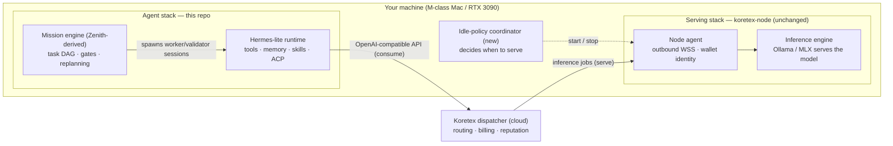
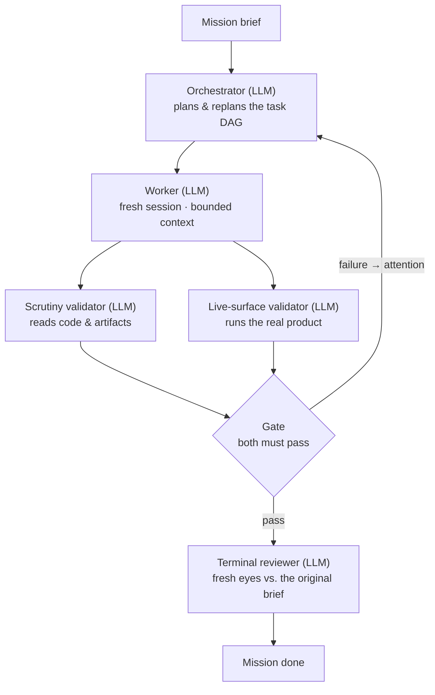
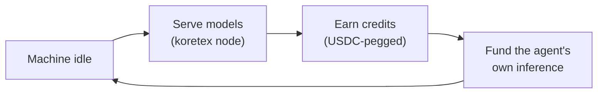
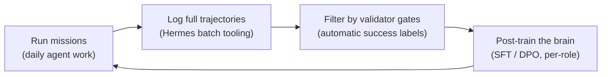

# Koretex Agent

*A lightweight, self-funding, self-improving AI agent — every install is also a node on the [Koretex](https://dispatcher.koretex.ai) distributed inference network.*

> **Status: design phase.** This document is the project's founding design record. No code yet — it captures the architecture, the reasoning behind it, and the roadmap, so a newcomer can start from zero and understand everything.

---

## The idea in one paragraph

Koretex Agent is a terminal AI assistant that pays for itself. When you install it, your machine gains two faces: an **agent** you work with (it writes code, runs commands, remembers you, learns skills), and a **provider node** that serves open-weight models to the Koretex network whenever your machine is idle. The agent's own inference is drawn from that same network and billed against the credits your idle hours earn. Under the hood, the agent compensates for using a modest (~15B parameter) model by wrapping it in a heavyweight orchestration harness — planning, parallel workers, independent verification — which multiplies token usage but is affordable precisely *because* tokens are self-funded. Over time, verified work trajectories from the harness become training data for post-training the 15B model itself, so the brain improves with usage.

## Why this exists

Three observations, each borrowed from a project we build on:

1. **Agent capability increasingly comes from the harness, not the model.** Intelligent Internet's [Zenith](https://github.com/Intelligent-Internet/zenith) showed that a disciplined orchestration layer (revisable planning, fresh bounded-context workers, independent evidence-traced verification) moved the *same model* from 5th to 1st place on long-horizon software tasks — at less than half the cost of brute force. The system around the model is the part builders can still own and improve.
2. **Harness-heavy agents are token-hungry, which makes them expensive on frontier APIs — but cheap on your own hardware.** A Zenith-style mission can burn 10–50× the tokens of a naive chat loop. On a metered frontier API that is prohibitive. On a network of consumer machines serving open models — especially when your own machine is one of them — the marginal cost approaches zero. Orchestration depth substitutes for model size, and distributed inference is what makes the substitution affordable.
3. **The demand and the supply arrive in the same box.** Every agent install adds a serving node to the network. More nodes → more and bigger models available → smarter agents → more reasons to install. Most compute networks struggle to bootstrap demand; here the agent *is* the demand.

There is a fourth, longer-term observation: because the harness independently verifies every piece of work before accepting it, the system labels its own trajectories. That is free, automatically-verified training data — exactly what is needed to post-train a purpose-built ~15B "brain" for this harness over time.

## What we are building on

We compose four existing systems rather than building from scratch. **Compose, don't merge** is a core principle: each piece keeps its own identity, release cadence, and (where applicable) wire protocol.

| Source | What we take | What we leave behind |
|---|---|---|
| [Hermes Agent](https://github.com/NousResearch/hermes-agent) (Nous Research, Python) | The agent "body": conversation loop, context engine + compression, prompt-caching discipline, shell/file tools, subagent delegation, the **learning loop** (agent-curated memory, autonomous skill creation, skill self-improvement, session search), cron scheduler, CLI/TUI, and the **ACP adapter** | The ~20-platform messaging gateway, Electron desktop app, voice, image gen, nearly all provider adapters (we keep exactly one: OpenAI-compatible), MoA, batch research tooling as a user-facing feature |
| [Zenith](https://github.com/Intelligent-Internet/zenith) (Intelligent Internet, Python, CC-BY-4.0) | The "work discipline": the mission coordinator (a deterministic state machine, ~6.5K LOC), revisable task DAGs, dual independent validators, gates, regression ledger, terminal review, the skills/playbook format | Its bundled prompts as-is (they assume frontier-model reasoning; we rewrite them for a 15B capability profile) |
| [koretex-node](../nosana/koretex-node) (TypeScript) | **Used unchanged.** Hardware detection, managed inference engine (Ollama/MLX), outbound-only WebSocket to the dispatcher, wallet identity, OS service management, the one-command installer | Nothing — it stays its own repo and its own release artifact |
| [Koretex marketplace](../nosana/marketplace) (TypeScript, server-side) | Used as-is: OpenAI-compatible endpoint, merit-based routing, credit ledger, USDC/Stripe settlement, reputation & anti-fraud. Earned provider credits are already spendable on the inference endpoint (self-spend works today) | — |

Key facts already settled:

- **Self-spend exists.** Credits earned by serving are the same credits the agent spends on the Koretex API endpoint. No marketplace changes required for the core loop.
- **Economics do not need to net out.** If a user consumes more than they contribute, they buy additional credits. Idle earnings are a subsidy, not a requirement.
- **Model target: ~15B dense**, post-trained over time (see [The brain](#the-brain-model-strategy)). A quantized 15B fits both an RTX 3090 (with large headroom) and the 16–24 GB Apple Silicon machines that will make up most Mac nodes — the model we train is the model the median node can serve.

## Architecture

### One machine, two faces



Notes on the two arrows to the dispatcher:

- **Consume:** the agent has exactly one inference client — OpenAI-compatible, pointed at the Koretex endpoint. Even when the model physically runs on the same machine, requests go through the dispatcher. One code path, honest billing, and the agent transparently gets a better model whenever the network has one.
- **Serve:** the node agent dials *out* — no inbound ports, NAT/firewall friendly. The dispatcher routes jobs to it based on measured throughput, latency, and reputation.

The **idle-policy coordinator** is one of the few genuinely new components. It watches user-input idle time, whether the agent itself is mid-mission, memory pressure, and power state, and drives the node via the existing `koretex start/stop` CLI. It needs hysteresis (serve only after sustained idle; stop instantly on activity) because the dispatcher's reputation system penalizes flapping nodes.

### How work gets done: missions

Casual conversation runs through the Hermes-lite chat loop directly. Substantial tasks become **missions** run by the Zenith-derived engine:



Why this shape lets a 15B model do serious work:

- **Every LLM call is small and narrow.** Workers and validators are fresh sessions with ~2–10K tokens of context (the task, its contract, a skill, project memory). The mission's long-horizon state lives on disk in the task graph, never in a context window. Small models are worst at long context and best at short, focused assignments.
- **The bookkeeping cannot hallucinate.** Dependency ordering, gate clearing, patch application, and stopping conditions are deterministic Python, not model judgment.
- **Structured handoffs are enforced, not requested.** Worker/validator outputs are strict JSON schemas. Because we control the serving stack, we enforce them with grammar-constrained decoding at the engine — malformed output ceases to be a failure mode. (Frontier-API users can't do this; we can.)
- **"Done" requires evidence.** A small model's most dangerous habit is confidently declaring victory. Here, work counts only when two independent validators produce per-assertion evidence, and a terminal reviewer who never saw the mission compares the result against the original brief.

### How it gets better over time

The system learns at three timescales; each loop feeds the next slower one.

| Loop | Timescale | Mechanism | Origin |
|---|---|---|---|
| Within a mission | minutes–hours | Regression ledger (failures recorded with repro steps; later workers read them), revisable plans | Zenith |
| Across sessions | days–weeks | **One shared skill library**: the conversational agent writes skills from everyday use; missions capture verified techniques; both read/write the same store (Hermes and Zenith use the same [agentskills.io](https://agentskills.io)-style Markdown format). Plus curated memory and session search | Hermes + Zenith, merged |
| In the weights | months / releases | Post-training the 15B brain on gate-verified trajectories | New (this project) |

And two flywheels that run continuously:

**The economic flywheel** — why heavy orchestration is affordable:



**The data flywheel** — why the brain improves with usage:



The data flywheel costs nothing extra: Hermes already ships trajectory capture and compression (`batch_runner.py`, `trajectory_compressor.py` — built for training tool-calling models), and Zenith already emits the labels (per-assertion validator verdicts, regression records, terminal-review verdicts). Keep trajectories that passed both validator lanes → automatically-labeled SFT data. Pair failed and passed attempts at the same task → preference data for DPO. The three LLM roles (orchestrator / worker / validator) have distinct prompts and schemas, so they can be post-trained as separate targets — e.g. per-role LoRA adapters on one base.

> **Privacy note (open question):** harvesting trajectories from our *own* machines is uncontroversial. Harvesting from users' machines requires explicit opt-in and is a deliberate design decision to make later, not a default.

## The brain (model strategy)

**Target: a ~15B dense model, post-trained continuously by the data flywheel.**

Why 15B dense (not bigger, not MoE):

- Quantized (Q4/Q5), a 15B dense model needs ~9–11 GB of accelerator memory — it fits an RTX 3090 with generous KV-cache headroom for long agentic contexts, and fits the 16–24 GB Apple Silicon machines that will be the network's most common nodes. **The model we train is the model the median node can serve.**
- Dense models are the simplest, best-understood post-training targets (LoRA/full SFT/DPO all routine). MoE models are faster to serve but trickier to fine-tune well.
- The harness is designed so the model never needs to be brilliant in long context — it needs to be reliable in short context with strict schemas. That is a trainable property at 15B.

**Off-the-shelf starting candidates** (all Apache 2.0 — a hard requirement, since we redistribute and fine-tune):

| Model | Shape | Why it's a candidate | Caveats |
|---|---|---|---|
| **Qwen3-14B** | 14B dense | Closest to target size; strong tool use; hybrid thinking/non-thinking modes; the most mature fine-tuning ecosystem of any open family | General-purpose — needs agentic post-training from us |
| **Qwen3-Coder-30B-A3B** | 30B MoE (3.3B active) | Best off-the-shelf local agentic coder (SWE-bench-class results); runs at 7B-class speed; ~19 GB — fits the 3090 and bigger Macs | MoE = harder post-training target; above the median-node size. Best as the *network's premium serving model* and interim brain, not the training base |
| **Devstral Small (24B)** | 24B dense | Purpose-built for agentic coding in a harness; published 46.8% SWE-Bench Verified | Heavier than target; ecosystem smaller than Qwen's |
| **gpt-oss-20b** | 21B MoE (3.6B active) | OpenAI open-weight; designed for agentic workflows with adjustable reasoning effort | MoE + harmony response format adds harness friction |
| Phi-4-reasoning (14B) | 14B dense | Strong reasoning at target size (MIT license) | Weaker generalist tool-caller; math-leaning |

**Working plan:** ship v0 with **Qwen3-Coder-30B-A3B** as the network's default serving model (best experience today), while adopting **Qwen3-14B as the post-training base** for the custom brain. Benchmark every brain release against Devstral Small as the external yardstick. Revisit candidates each quarter — the open-model landscape moves fast.

## Design principles

1. **Compose, don't merge.** koretex-node stays a separate repo/artifact; Zenith's coordinator stays a distinct package; the dispatcher is a service we operate. Boundaries are process/protocol boundaries (ACP, OpenAI-compatible HTTP, WSS), not code entanglement.
2. **Narrow waist, capability at the edges** (inherited from Hermes). Every core tool is paid for on every API call. New capability arrives as skills and plugins, not core surface.
3. **Prompt caching is sacred** (inherited from Hermes). Nothing mutates past context or rebuilds the system prompt mid-conversation.
4. **Determinism where possible, models where necessary** (inherited from Zenith). Scheduling, gating, and state transitions are code. LLMs fill three narrow, schema-constrained roles.
5. **Evidence-gated completion.** No work is "done" because a model says so — two independent validators plus a terminal reviewer must agree, with traceable evidence.
6. **Own the serving stack, exploit it.** Grammar-constrained decoding, pinned engines, and per-role sampling settings are competitive advantages unavailable to frontier-API agents.
7. **One skill library.** Conversational learning and mission learning write to the same store, in the agentskills.io format.
8. **Lightweight means small surface, not shallow reasoning.** We strip frontends, providers, and bloat — we do not strip the orchestration depth that makes a 15B model useful.

## Repo layout

Two repos users touch, one service we operate:

```
koretex-agent/          ← this repo (Python) — the product
  agent/                  Hermes-lite runtime (pared-down fork)
  mission/                Zenith-derived coordinator + small-model prompts
  coordinator/            idle-policy daemon (start/stop serving)
  installer/              one-command install: agent + koretex-node + model + wallet
  training/               trajectory harvest → filter → SFT/DPO pipeline
  docs/                   this document, ADRs, experiment notes

koretex-node/           ← separate repo (TypeScript) — unchanged, installed as a dependency

marketplace/            ← separate repo (TypeScript) — the dispatcher; server-side, not user-installed
```

Rationale: the agent runtime, mission engine, idle policy, and installer version together (a prompt change and a runtime change often land as one unit), so they share a repo. The node has its own stable wire protocol, installer, and release cadence — absorbing it would couple two release cycles for no benefit.

## Roadmap

**Phase 0 — Validate the premises (no new code).**
Run stock Hermes + the existing `koretex-node-provider` skill on one machine against the live dispatcher; separately run stock Zenith with its `hermes` provider against a locally-served open model (Qwen3-14B, Qwen3-Coder-30B, gemma3:12b for baseline). Give it 2–3 real engineering missions.
*Measure:* JSON-handoff validity rate, validator verdict quality (do they rubber-stamp?), premature-completion catches, orchestrator replan sanity, tokens per mission.
*Exit criteria:* a ≤30B open model can hold the worker and validator roles with acceptable reliability; we know which roles need the most help. **The single biggest risk retired here is the validator role — if validators rubber-stamp, the evidence-traced premise collapses.*

**Phase 1 — The fork.**
Pare Hermes to the keep-list (trace what a single CLI conversation imports; build bottom-up from that dependency graph). Single OpenAI-compatible provider pointed at Koretex. Keep: learning loop, tools, subagents, cron, CLI/TUI, ACP. Wire in the Zenith coordinator as a package; rewrite the three role prompts for the 15B capability profile; enable grammar-constrained decoding server-side.
*Exit criteria:* one machine runs a full mission end-to-end through the Koretex endpoint.

**Phase 2 — One install, two faces.**
Unified installer (agent + koretex-node + engine + model + wallet). Idle-policy coordinator with hysteresis. Balance surfaced in the agent's status line.
*Exit criteria:* a fresh machine goes from `curl | bash` to (a) chatting with the agent and (b) visibly earning credits, with zero manual steps.

**Phase 3 — Polish the loop.**
Autoserve tuning (serve the highest-demand model that fits), graceful degradation when the network lacks a good model (BYO-key fallback), skill-library unification, reputation-aware serving policy.
*Exit criteria:* a non-technical user can live on this daily.

**Phase 4 — The brain (runs in parallel from Phase 0).**
Wire Hermes trajectory logging into mission runs; accumulate gate-verified trajectories; rejection-sample → SFT → DPO on Qwen3-14B; per-role adapters if warranted. Quarterly brain releases, benchmarked against Devstral Small and the previous release.
*Exit criteria (v1 brain):* our 15B post-trained model matches or beats the best off-the-shelf ≤30B model *inside our harness* on our mission benchmark.

## Risks & open questions

| Risk | Mitigation |
|---|---|
| A ~15B model can't hold the validator role honestly | Phase 0 measures this first; constrained decoding + atomic single-assertion contracts + execution-based evidence reduce the ask; escalate validator role to the network's premium model if needed |
| Network latency/churn breaks long missions | Missions are disk-checkpointed state machines (resume is native); dispatcher reputation routing improves with supply |
| Model quality on the network disappoints early users | Ship with Qwen3-Coder-30B default + BYO-key escape hatch; purity here would kill adoption |
| Idle-detection gets serving reputation wrong (flapping) | Hysteresis; deregister-first/evict-under-pressure tiering; measure against the marketplace's points system |
| User-trajectory privacy | Own-machines-only until an explicit opt-in design exists |
| Upstream drift (Hermes ships aggressively) | Fork-and-diverge; cherry-pick rarely and deliberately |

## Glossary

- **ACP** — Agent Client Protocol; JSON-RPC over subprocess stdio, how the mission engine spawns agent sessions.
- **Dispatcher** — the Koretex cloud control plane: routes inference jobs, meters usage, settles credits.
- **Gate** — a synchronization point in a mission's task graph that clears only when all its validators pass.
- **Mission** — a substantial task run as a Zenith-style plan/work/validate/review lifecycle.
- **Node** — a provider machine serving models to the network via koretex-node.
- **Self-spend** — spending provider-earned credits as an inference customer under the same wallet (live today).
- **Skill** — a reusable Markdown-documented technique (agentskills.io format), created and improved by the agent itself.
- **Trajectory** — the full log of an agent session (every message and tool call), harvestable as training data.

## References

- Hermes Agent — https://github.com/NousResearch/hermes-agent
- Zenith harness + technical report — https://github.com/Intelligent-Internet/zenith and https://ii.inc/blog/post/zenith
- Koretex node — (repo: `koretex-node`) · Koretex marketplace/dispatcher — (repo: `marketplace`)
- agentskills.io skill standard — https://agentskills.io
