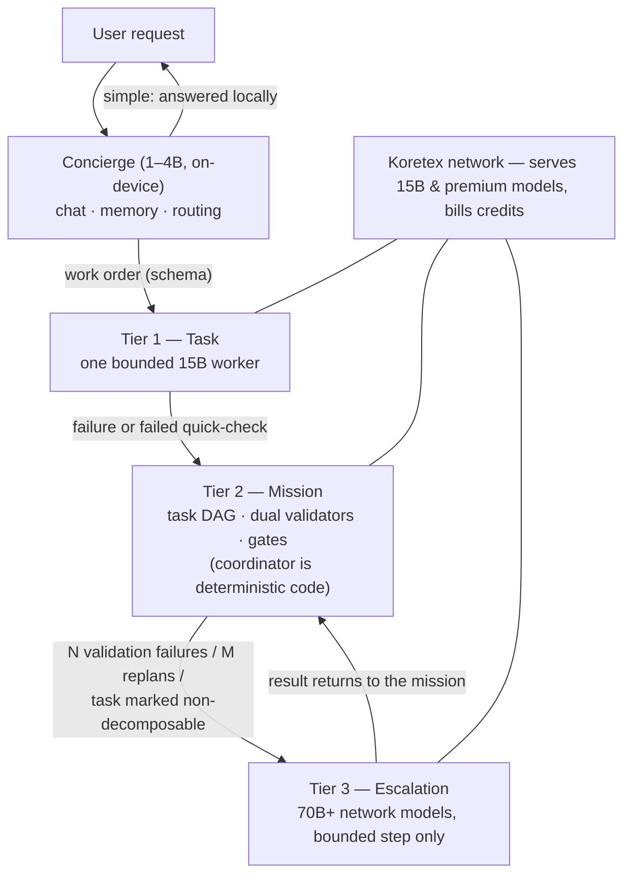
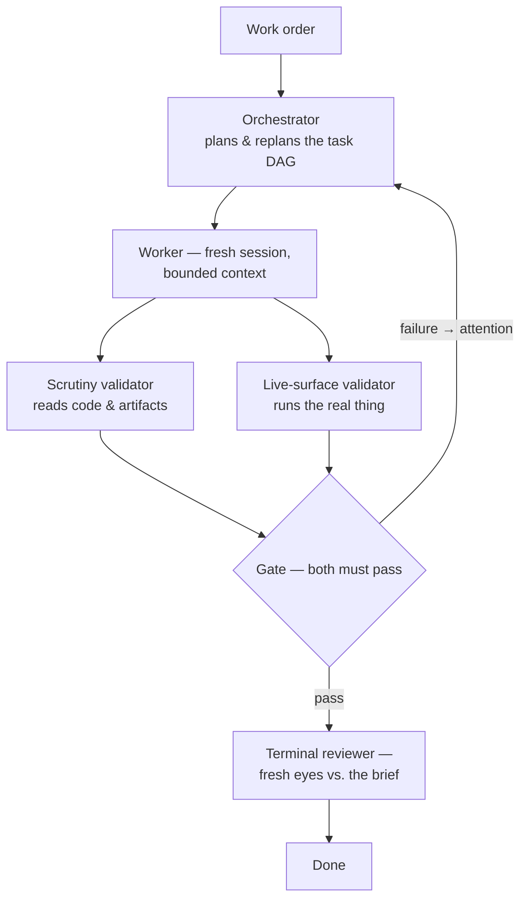
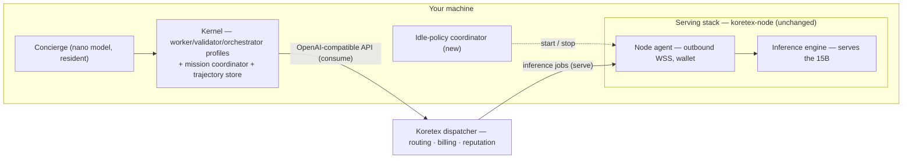
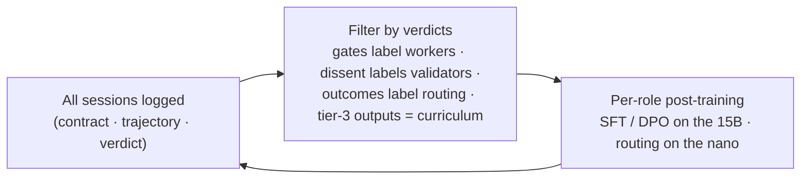

# Koretex Agent

*A lightweight, self-funding, self-improving AI agent — every install is also a provider node on the [Koretex](https://dispatcher.koretex.ai) distributed inference network.*

> **Status: design phase, Phase 0 validation complete.** This document is the project's founding design record — architecture, reasoning, and roadmap — written so a newcomer can start from zero. Empirical grounding for the key decisions is in [docs/phase0-findings.md](docs/phase0-findings.md).

---

## The idea in one paragraph

Koretex Agent is a terminal AI assistant that pays for itself. Install it and your machine gains two faces: an **agent** you work with (it writes code, runs commands, remembers you, learns skills), and a **provider node** that serves open-weight models to the Koretex network whenever your machine is idle. The agent's inference is drawn from that same network and billed against the credits your idle hours earn (self-spend works on the network today; users who consume more than they contribute simply buy credits). The agent compensates for using modest open models with a disciplined orchestration harness — bounded workers, independent verification, lazy escalation — that lets a **~15B model do most of the work**, and it turns its own verified work into training data so that model keeps getting better.

## Why this exists

1. **Agent capability increasingly comes from the harness, not the model.** Intelligent Internet's [Zenith](https://github.com/Intelligent-Internet/zenith) showed a disciplined harness moving the *same model* from 5th to 1st on long-horizon software tasks at less than half the cost of brute force. The system around the model is the part builders can still own.
2. **Harness-heavy agents are token-hungry — prohibitive on frontier APIs, nearly free on your own hardware.** A verified mission burns 10–50× the tokens of a naive chat loop. On a network of consumer machines serving open models — especially when your machine is one of them — marginal cost approaches zero. Orchestration depth substitutes for model size.
3. **Demand and supply arrive in the same box.** Every install adds a serving node. More nodes → more and bigger models → smarter agents → more installs. The agent *is* the network's demand.
4. **Verified work labels itself.** Because independent validators gate every piece of work, the system produces automatically-labeled trajectories — exactly what's needed to post-train a purpose-built ~15B brain, continuously.

## What Phase 0 taught us (and how it shaped the design)

We ran the existing pieces — stock [Hermes](https://github.com/NousResearch/hermes-agent), stock Zenith, Qwen3-14B on an 18 GB M3 Pro, the live Koretex dispatcher — before writing any code. Full details in [docs/phase0-findings.md](docs/phase0-findings.md). The verdicts that drive everything below:

| Finding | Design consequence |
|---|---|
| A 14B in a **fresh, bounded session** tool-calls cleanly, executes small tasks, and — critically — **validates honestly** (it refused to pass a broken build, with real executed evidence) | Small bounded sessions are the unit of work; the validator bet holds |
| A 14B running **naively** produced plausible code with a broken test suite and never noticed for 75+ minutes | Independent verification is mandatory, not optional |
| Stock Hermes carries a **~25K-token fixed prefix** (40 KB prompt + 58 KB schemas / 35 tools); with Zenith's 32 KB playbooks it overflows a 32K window, triggers compaction, and the model **loses its role entirely** | Context budgets must be enforced structurally; frontier-sized prompts are fatal at 15B scale |
| Every failure was caused by inherited frontier-model assumptions, not missing features | **Build a small new runtime; borrow designs, not codebases** |

That last line is a deliberate reversal of an earlier plan to fork Hermes. Hermes's bulk is variance absorption for 20 providers and 20 chat platforms — environments this product eliminates by design (one provider, whose serving stack we control). What we keep from Hermes are its best *ideas*: the skill format and learning loop, memory-as-curated-files, session search, ACP, prompt-caching discipline. What we keep from Zenith is its best *code*: the deterministic mission coordinator (~6.5K clean, model-agnostic LOC). Everything else is new and small.

## Architecture

### One kernel, four profiles

There is one runtime — the **kernel**: a single OpenAI-compatible client pointed at the Koretex endpoint, ~10 tools, an ACP server, and a trajectory recorder. Every role in the system is the kernel launched with a different **profile** = system prompt + tool subset + model tier + a hard context budget:

| Profile | Model tier | Prefix budget (prompt + schemas) | Job |
|---|---|---|---|
| Concierge | 1–4B, on-device, always resident | ≤ 1.5K tokens | converse, remember, route |
| Worker | 15B | ≤ 3K + task payload | execute one bounded task |
| Validator | 15B | ≤ 2.5K + contract | independently verify one task |
| Orchestrator | largest available (escalated early on; distilled down over time) | ≤ 5K | plan and replan missions |

**Prefix budgets are enforced by CI**: a build-time test assembles each profile's real prefix, counts tokens, and fails the build if over budget. This is the structural answer to how Hermes drifted to 25K — good intentions don't survive contact with feature growth; failing builds do.

Two more structural guards against prompt bloat:
- **Skills** appear in prompts only as a relevance-filtered catalog (name + one line, ~15 entries max); bodies load just-in-time via a `use_skill` tool.
- **Memory** never enters worker prompts globally. The concierge/planner injects only task-relevant snippets into the work order. Context is assembled per task, not inherited.

### The escalation ladder

Every request enters at the cheapest tier and climbs only on explicit, code-enforced triggers:



Design notes:

- **Tier 3 receives a step, never a mission.** The big model gets a bounded contract like any worker; mission state stays local and deterministic. Premium spend stays surgical, and every tier-3 output becomes curriculum for the 15B.
- **The concierge is biased hard toward escalating.** v0 ships with it doing only memory + routing (plus trivialities); its self-answer whitelist widens only as routing data accumulates. On desktop, v0 can even ship without tier 0 — it's additive.
- **Target KPI: ≥ 90% of tokens spent at tier ≤ 2**, tracked per mission. Each brain release should push the escalation rate down; if it won't move, that's the signal to grow the standard model (~24B) rather than lean on escalation.
- Contracts, handoffs, and verdicts crossing every tier boundary are strict JSON schemas, **enforced by grammar-constrained decoding at the serving layer** — we own the servers, so malformed output is not a failure mode. Frontier-API agents can't do this; we can.

### The mission tier (Zenith's coordinator, vendored)

Substantial work runs as a **mission**: a deterministic state machine (task DAG with explicit dependencies, atomic replanning patches, an attention queue) where LLMs fill only three narrow roles — plan, work, judge:



Why this lets a 15B do serious work: every LLM call is short-context and narrow (the regime Phase 0 showed a 14B is best at); the bookkeeping — dependencies, gates, stopping — cannot hallucinate because it's code; "done" requires two independent validators' executed evidence plus a fresh-eyes terminal review (the exact mechanism that catches the plausible-code-broken-tests failure we watched a naive 14B ship). Validator evidence uses constrained formats (raw pasted command output, not prose) — Phase 0 showed verdict-level honesty is good but free-text evidence gets embellished.

### One machine, two faces



- The agent consumes **through the dispatcher even when the model runs on the same machine**: one code path, honest billing, and a transparently better model whenever the network has one.
- [koretex-node](https://github.com/koretex-ai) is used unchanged, as a separate repo/artifact: hardware detection, managed engine, outbound-only WebSocket, wallet identity, OS service management.
- The idle-policy coordinator (new, small) watches input idle time, agent activity, memory pressure, and power state, and drives the node via the existing `koretex` CLI — with hysteresis, because the dispatcher's reputation system penalizes flapping nodes.

## How it learns

Three loops at three timescales, each feeding the next slower one.

### Loop 1 — within a mission (minutes–hours)
Regression ledger: every validator catch is recorded with setup, command, expected and observed output; later workers read it and stop repeating the mistake. Plans are revised in place when assumptions break. (Zenith's mechanism, kept.)

### Loop 2 — skills, across sessions (days–weeks)
The Hermes learning loop, upgraded with ground truth Hermes never had:

- After a gate-passed mission (or repeated tier-1 successes of the same shape), a **skill-synthesizer** profile distills the trajectory into a skill — [agentskills.io](https://agentskills.io) Markdown, one shared library for all profiles. Skill *synthesis* is a judgment task: it escalates to tier 3 initially (one premium call per successful mission) and distills down later.
- Every trajectory records which skills were loaded; gates then label whether they helped. **Skills accumulate win/loss stats.** A background curator (Hermes's idea, kept) improves winners, merges duplicates, retires losers. Skill quality is measured, not vibes.
- Session search (Hermes's idea, kept) runs as a concierge *tool* over the trajectory store — zero prefix cost, full recall of past work.
- Memory (who you are, preferences, ongoing projects) lives on-device with the concierge — the privacy-friendly place — as curated files.

### Loop 3 — the weights (months / releases)

Data capture is **structural, not bolted on**: the kernel records every session as a `(contract, full trajectory, verdict)` triple — messages, tool calls, results, skills used, model tier, mission linkage. Because tiers only communicate through schemas, labels come for free:



- Rejection-sample gate-passed trajectories → SFT; pair failed/passed attempts at the same task → DPO; tier-3 escalation outputs → the 15B's curriculum for exactly the steps it currently can't do.
- Each brain release is benchmarked on escalation rate and a fixed mission suite. The loops compound: better brain → more honest validators → cleaner labels → better brain.
- **Privacy:** default-on for our own machines; user machines contribute only via an explicit opt-in that is designed in from day one, not retrofitted.

## The models

| Tier | Target | Notes |
|---|---|---|
| Nano (concierge) | 1–4B (Qwen3-1.7B/4B class), runs on phones | post-trained for routing + memory ops; the mobile story |
| Standard (the brain) | **~15B dense — post-training base: Qwen3-14B** (Apache 2.0) | Q4 ≈ 9–11 GB: fits an RTX 3090 with headroom *and* 16–24 GB Apple Silicon — the model we train is the model the median node can serve. Dense = the simplest post-training target |
| Premium (escalation) | 30B–70B+ (e.g. Qwen3-Coder-30B-A3B today) served by bigger providers | until premium supply exists on the network, tier 3 needs a BYO-key fallback — purity here would kill adoption |

Off-the-shelf interim: Qwen3-Coder-30B-A3B as the network's best serving model today; Devstral Small (24B) as the external benchmark yardstick. The landscape moves fast — the commitment is the strategy (dense ~15B trained by loop 3, quarterly re-evaluation), not any single checkpoint.

## Design principles

1. **One kernel, many profiles.** Roles are configurations, not codebases.
2. **Escalate lazily.** Intelligence is bought per step, never defaulted to.
3. **Contracts between tiers, always** — schema-enforced via constrained decoding.
4. **Determinism outside the model.** DAGs, gates, budgets, escalation counters: code.
5. **Evidence-gated completion.** Two independent validators + terminal review; evidence in constrained formats.
6. **Context budgets are build failures, not guidelines.**
7. **Memory with the concierge; skills with the work.**
8. **Borrow designs, not codebases** — except Zenith's coordinator, which is borrowed *as code* because it's small, clean, and model-agnostic.
9. **Own the serving stack and exploit it** (constrained decoding, pinned engines, per-role sampling).
10. **Lightweight means small surface and small prefixes — not shallow reasoning.**

## Repo layout

```
koretex-agent/          ← this repo (Python) — the product
  kernel/                 runtime: client, tools, ACP, trajectory recorder
  profiles/               concierge / worker / validator / orchestrator / skill-synthesizer
                          (prompts + tool subsets + budgets; CI-enforced)
  mission/                vendored Zenith coordinator + our schemas
  ladder/                 escalation policy, triggers, KPIs
  coordinator/            idle-policy daemon
  installer/              one command: agent + koretex-node + models + wallet
  training/               trajectory store, filters, SFT/DPO pipeline
  docs/                   this record, phase findings, ADRs
  phase0/                 Phase 0 experiment artifacts (kept for reference)

koretex-node/           ← separate repo (TypeScript) — unchanged, installed as a dependency
marketplace/            ← separate repo (TypeScript) — the dispatcher; operated, not installed
```

## Roadmap

**Phase 0 — validate the premises. ✅ Done** ([findings](docs/phase0-findings.md)): bounded-session worker/validator viability on 14B confirmed; naive-loop and fat-prefix failure modes confirmed; fork-vs-build decision made.

**Phase 1 — the kernel.** Runtime + worker/validator profiles within budget (CI gate from day one), constrained decoding at the serving layer, trajectory recorder, mission tier via vendored Zenith coordinator with small-model role prompts. *Exit: a mission that stock setups failed in Phase 0 (csv2json with a working test suite) completes end-to-end on a 15B through the Koretex endpoint, with the validator catching at least one real defect along the way.*

**Phase 2 — the ladder.** Escalation triggers + counters, tier-3 integration (network premium + BYO-key fallback), escalation-rate metric, terminal review. *Exit: a hard mission visibly escalates only its irreducible step and completes.*

**Phase 3 — one install, two faces.** Unified installer (kernel + koretex-node + models + wallet), idle-policy coordinator, balance in the status line. *Exit: fresh machine → `curl | bash` → chatting agent + visibly earning node, zero manual steps.*

**Phase 4 — the learning loops.** Skill-synthesizer + win/loss ledger + curator; session search; training pipeline producing the first SFT/DPO sets; first post-trained 15B release. *Exit: brain v1 beats its base model on the fixed mission suite and lowers the escalation rate.*

**Phase 5 — the concierge.** Nano profile on desktop (memory + routing only), then mobile. *Exit: routing precision ≥ target on held-out work orders; mobile app consuming the network.*

## Risks

| Risk | Mitigation |
|---|---|
| 15B can't hold orchestration even with clean prefixes | orchestrator runs at tier 3 first, distills down; that's the designed path, not a failure mode |
| Tier-0 routing miscalibration | v0: route-and-remember only; widen whitelist on data |
| No premium supply on the network yet | BYO-key fallback at tier 3 until provider fleet grows |
| Prompt/prefix drift back toward bloat | CI token-budget gate fails the build |
| Validator evidence embellishment (seen in Phase 0) | constrained evidence formats: raw command output, per-assertion schemas |
| Idle-serving flaps and hurts node reputation | hysteresis in the idle-policy coordinator; measured against the dispatcher's points system |
| Trajectory privacy on user machines | own-machines default; explicit opt-in designed in from day one |
| Zenith coordinator maturity (v0.1.0, CC-BY-4.0) | vendored with attribution; small enough to own outright if upstream stalls |

## Glossary

- **Kernel** — the single runtime; every role is the kernel + a profile.
- **Profile** — prompt + tool subset + model tier + hard context budget.
- **Work order / handoff / verdict** — the schemas crossing tier boundaries.
- **Mission** — tier-2 work: task DAG + dual validators + gates + terminal review.
- **Gate** — clears only when both validators pass with evidence.
- **Escalation ladder** — tiers 0–3; requests climb only on explicit triggers.
- **Trajectory triple** — `(contract, trajectory, verdict)`; the unit of training data.
- **Skill** — reusable technique in agentskills.io Markdown, with measured win/loss stats.
- **Self-spend** — provider-earned credits spent on inference under the same wallet (live on Koretex today).

## Lineage & references

- **Hermes Agent** (Nous Research) — https://github.com/NousResearch/hermes-agent — source of the learning-loop design (skills, curator, memory, session search), ACP usage, prompt-caching discipline, and the narrow-waist philosophy. We borrow its designs and formats, not its runtime.
- **Zenith** (Intelligent Internet) — https://github.com/Intelligent-Internet/zenith + [technical report](https://ii.inc/blog/post/zenith) — source of the mission coordinator (vendored), dual-validator gates, regression ledger, and the harness-over-model thesis.
- **Koretex** — `koretex-node` and `marketplace` repos — the serving network and economics.
- **agentskills.io** — the open skill standard both lineages share.
