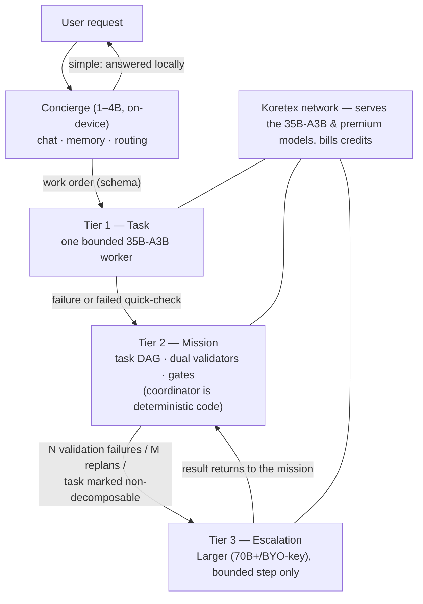
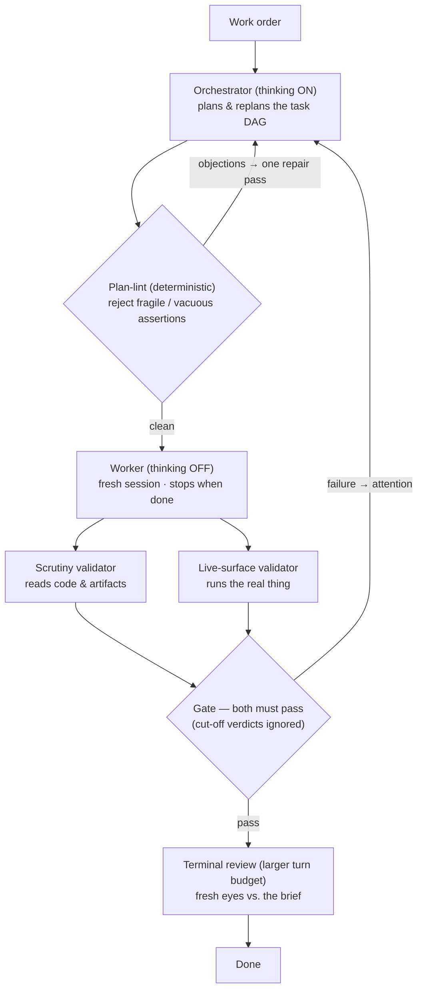
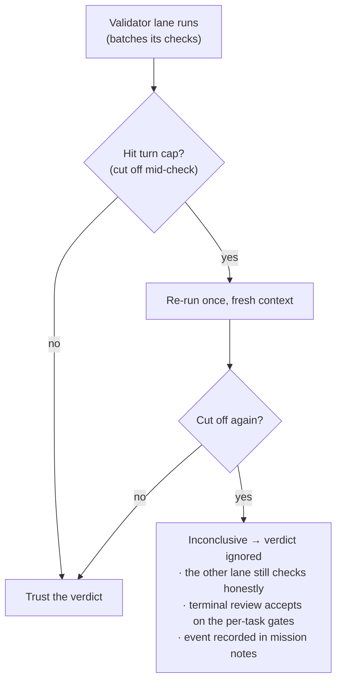
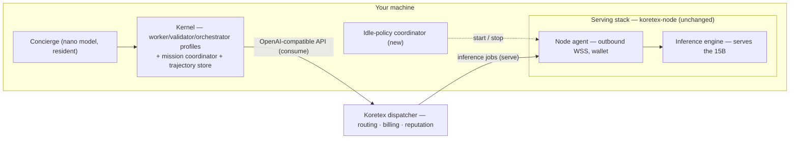
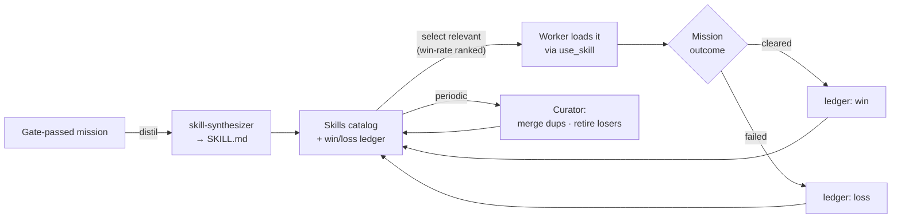
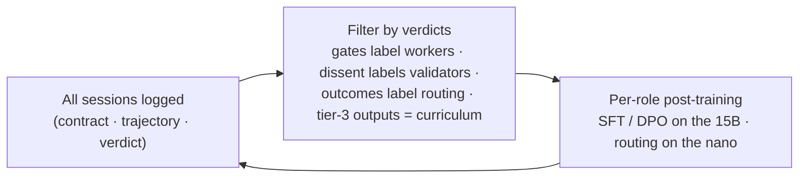

# Koretex Agent

*A lightweight, self-funding, self-improving AI agent — every install is also a provider node on the [Koretex](https://dispatcher.koretex.ai) distributed inference network.*

> **Status: the kernel, the tier-0 concierge, and both learning loops are built and validated on real missions over the Koretex network.** This document is the founding design record — architecture, reasoning, and roadmap. The design below is the target; the [Implementation status](#implementation-status) table is the current reality, and [Phase 1 as built](#phase-1-as-built--tuning-a-1535b-into-disciplined-roles) records the tuning that made real 15–35B models behave. Empirical grounding: [docs/phase0-findings.md](docs/phase0-findings.md), [docs/phase1-findings.md](docs/phase1-findings.md), the run-by-run [docs/benchmarks.md](docs/benchmarks.md), and the [docs/seeker-gtm.md](docs/seeker-gtm.md) distribution brief.

---

## The idea in one paragraph

Koretex Agent is a terminal AI assistant that pays for itself. Install it and your machine gains two faces: an **agent** you work with (it writes code, runs commands, remembers you, learns skills), and a **provider node** that serves open-weight models to the Koretex network whenever your machine is idle. The agent's inference is drawn from that same network and billed against the credits your idle hours earn (self-spend works on the network today; users who consume more than they contribute simply buy credits). The agent compensates for using modest open models with a disciplined orchestration harness — bounded workers, independent verification, lazy escalation — that lets a **compact MoE (35B-A3B, ~3B active) do most of the work at small-model cost**, and it turns its own verified work into training data so that model keeps getting better.

## Implementation status

*Updated as built (2026-07). The rest of this document is the design target; this table is the current reality. The build has run ahead on the learning loops and the tier-0 concierge, and left the ladder's upper rungs and the installer for later — driven by what each stage's data demanded next (see [docs/NEXT-STEPS.md](docs/NEXT-STEPS.md)).*

| Component | Status | Notes |
|---|---|---|
| **Kernel** — client · tools · session loop · schemas · trajectory recorder | ✅ built | one OpenAI-compatible client; ~10 sandboxed tools; bounded, turn-capped sessions |
| **Profiles** + CI prefix-budget gate | ✅ built | worker · validator · scrutiny · orchestrator · concierge · skill-synthesizer, each under budget |
| **Mission tier** — plan → lint → work → dual-validate → review | ✅ built | deterministic coordinator; passes the exit mission *repeatedly* on 35B-A3B (Q4) over the network |
| **Tuning** — per-profile reasoning · stop-when-done · plan-lint · cut-off-validator handling | ✅ built | [Phase 1 as built](#phase-1-as-built--tuning-a-1535b-into-disciplined-roles); consistency shown across repeated runs |
| **Ladder tier 0** — concierge routing (chat / task / mission) + auto-escalation | ✅ built | on-device router; tier-1 shortfall escalates to a mission |
| **Ladder tier 3** — stronger-model escalation of an irreducible step, triggers & counters | ✅ built | bounded contract, state stays local, verification stays at tier 2; per-mission escalation budget; env-gated (off = unchanged behavior) |
| **Escalation-rate metric** — per-tier token ledger + KPI (≥90% of tokens at tier ≤2) | ✅ built | `tiers.py`; reported per mission and across the concierge ladder |
| **Loop 3** — trajectory harvest → per-role SFT/DPO datasets | ✅ built | worker + validator + routing; gate-linked labels |
| **Consent-gated, scrubbed export** (S3) | ✅ built | opt-in gate + secret/PII scrub *before* anything leaves the machine |
| **Loop 2** — skills: synthesis · auto-wiring · curator | ✅ built | distil → select-into-missions → score → merge/retire; a ranked, self-gardening `SKILL.md` library |
| **GPU post-training run → brain v1** | ⬜ separate repo | datasets are produced here; training runs elsewhere |
| **One install, two faces** — installer + idle-policy daemon | ⬜ designed | Phase 3 |
| **Nano concierge on-device / mobile** (Solana Seeker) | ⬜ designed | [docs/seeker-gtm.md](docs/seeker-gtm.md) — phone = consumer client, not a serving node |

The kernel is one small Python package (`koretex_agent/`) with a green test suite including the build-failing prefix-budget gate. What is *not* yet built: the unified installer + idle daemon, the on-device nano concierge, and the actual weight-training run (a separate repo).

## Why this exists

1. **Agent capability increasingly comes from the harness, not the model.** Intelligent Internet's [Zenith](https://github.com/Intelligent-Internet/zenith) showed a disciplined harness moving the *same model* from 5th to 1st on long-horizon software tasks at less than half the cost of brute force. The system around the model is the part builders can still own.
2. **Harness-heavy agents are token-hungry — prohibitive on frontier APIs, nearly free on your own hardware.** A verified mission burns 10–50× the tokens of a naive chat loop. On a network of consumer machines serving open models — especially when your machine is one of them — marginal cost approaches zero. Orchestration depth substitutes for model size.
3. **Demand and supply arrive in the same box.** Every install adds a serving node. More nodes → more and bigger models → smarter agents → more installs. The agent *is* the network's demand.
4. **Verified work labels itself.** Because independent validators gate every piece of work, the system produces automatically-labeled trajectories — exactly what's needed to post-train a purpose-built ~15B brain, continuously.

## What Phase 0 taught us (and how it shaped the design)

We ran the existing pieces — stock [Hermes](https://github.com/NousResearch/hermes-agent), stock Zenith, Qwen3-14B on an 18 GB M3 Pro, the live Koretex dispatcher — before writing any code. Full details in [docs/phase0-findings.md](docs/phase0-findings.md). The verdicts that drive everything below:

| Finding | Design consequence |
|---|---|
| A 14B in a **fresh, bounded session** tool-calls cleanly, executes small tasks, and — critically — **validates honestly** (it refused to pass a broken build, with real executed evidence) | Small bounded sessions are the unit of work; the validator bet holds |
| A 14B running **naively** produced plausible code with a broken test suite and never noticed for 75+ minutes | Independent verification is mandatory, not optional |
| Stock Hermes carries a **~25K-token fixed prefix** (40 KB prompt + 58 KB schemas / 35 tools); with Zenith's 32 KB playbooks it overflows a 32K window, triggers compaction, and the model **loses its role entirely** | Context budgets must be enforced structurally; frontier-sized prompts are fatal at 15B scale |
| Every failure was caused by inherited frontier-model assumptions, not missing features | **Build a small new runtime; borrow designs, not codebases** |

That last line is a deliberate reversal of an earlier plan to fork Hermes. Hermes's bulk is variance absorption for 20 providers and 20 chat platforms — environments this product eliminates by design (one provider, whose serving stack we control). What we keep from Hermes are its best *ideas*: the skill format and learning loop, memory-as-curated-files, session search, ACP, prompt-caching discipline. What we keep from Zenith is its best *code*: the deterministic mission coordinator (~6.5K clean, model-agnostic LOC). Everything else is new and small.

## Architecture

### One kernel, four profiles

There is one runtime — the **kernel**: a single OpenAI-compatible client pointed at the Koretex endpoint, ~10 tools, an ACP server, and a trajectory recorder. Every role in the system is the kernel launched with a different **profile** = system prompt + tool subset + model tier + a hard context budget:

| Profile | Model tier | Prefix budget (prompt + schemas) | Reasoning | Job |
|---|---|---|---|---|
| Concierge | 1–4B, on-device, always resident | ≤ 1.5K tokens | — | converse, remember, route |
| Worker | **35B-A3B** (standard tier) | ≤ 3K + task payload | off | execute one bounded task |
| Validator · Scrutiny | **35B-A3B** (standard tier) | ≤ 2.5K + contract | off | two independent lanes verify one task |
| Orchestrator | **35B-A3B** (standard tier) | ≤ 5K | **on** | plan and replan missions |

The standard tier is the **Qwen3.6-35B-A3B** — a mixture-of-experts model with **~3B active parameters**, so it runs at small-model compute/latency (a 3B forward pass) while reasoning with a 35B model's knowledge. That combination is why it, not a dense ~15B, is the workhorse: empirically a dense 14B is both too slow as a thinking-on orchestrator (multi-minute plans) and too weak as a worker (it produced syntactically-broken parsers and couldn't converge), whereas the 35B-A3B plans in seconds and clears the same work — at comparable cost. The ladder is therefore **concierge (1–4B) → 35B-A3B standard tier → Larger (70B+/BYO-key) escalation**; there is no separate dense-15B rung.

The "verify" role ships as **two profiles / two independent lanes** — `validator` runs the live surface (executes the contract commands) and `scrutiny` reads the source for frauds — and a task clears only when both pass. The reasoning column is the Phase 1 tuning: thinking helps only the planner ([details below](#phase-1-as-built--tuning-a-1535b-into-disciplined-roles)).

**Prefix budgets are enforced by CI**: a build-time test assembles each profile's real prefix, counts tokens, and fails the build if over budget. This is the structural answer to how Hermes drifted to 25K — good intentions don't survive contact with feature growth; failing builds do.

Two more structural guards against prompt bloat:
- **Skills** appear in prompts only as a relevance-filtered catalog (name + one line, ~15 entries max); bodies load just-in-time via a `use_skill` tool.
- **Memory** never enters worker prompts globally. The concierge/planner injects only task-relevant snippets into the work order. Context is assembled per task, not inherited.

### The escalation ladder

Every request enters at the cheapest tier and climbs only on explicit, code-enforced triggers:



Design notes:

- **Tier 3 receives a step, never a mission.** ✅ *Built* (`Mission._attempt_escalation`). When tier 2 can't clear a step — attempts exhausted, or a worker still blocked after a bounded replan — that one step is handed to a stronger model under the *same* contract, in the *same* local workdir. Crucially, **verification stays at tier 2**: the escalated work still has to pass the independent two-lane gate, so escalation improves the attempt without bypassing the check. A per-mission **escalation budget** (default 2) + an explicit counter keep tier-3 rare. It's env-gated (`KORETEX_AGENT_ESCALATION_MODEL`/`_BASE_URL`/`_API_KEY`); unset → tier-3 is simply off and missions behave exactly as before. Every tier-3 output becomes curriculum for the 35B-A3B standard tier. *Demonstrated on a live model: a stuck step escalated to a real stronger worker that produced the deliverable, real validators cleared it, ledger split mission 16.8K / escalation 4.3K tokens (`scripts/probe-escalation.py`). Note: a Larger network model above the 35B-A3B is not yet available — until a BYO-key premium endpoint is wired, tier-3's genuine capability-gap demo on complex tasks is a standing TODO (see [NEXT-STEPS](docs/NEXT-STEPS.md)).*
- **The concierge is biased hard toward escalating.** v0 ships with it doing only memory + routing (plus trivialities); its self-answer whitelist widens only as routing data accumulates. On desktop, v0 can even ship without tier 0 — it's additive.
- **Target KPI: ≥ 90% of tokens spent at tier ≤ 2.** ✅ *Built* (`tiers.py`, `TierLedger`). Every model call is charged to the tier that made it; `escalation_rate` = fraction of tokens above tier 2, and `within_kpi()` checks it against the 0.90 floor. Reported per mission and merged across the whole concierge ladder (tier 0 routing + tier 1 worker + tier 2/3 mission). It's the same yardstick for cost *and* learning: each brain release should push the escalation rate down; if it won't move, that's the signal to grow the standard model rather than lean on escalation. *Demonstrated healthy-case, live: a full 2-task mission on the 35B-A3B standard tier cleared both tasks on attempt 1 with **100% of 192K tokens at tier ≤2** (escalation_rate 0, KPI passes) — and the deliverable was a correct hand-written parser passing the exact right-associative-`**` and unary-precedence cases a dense 14B produced broken code for (`scripts/live-escalation-mission.py`).*
- Contracts, handoffs, and verdicts crossing every tier boundary are strict JSON schemas, **enforced by grammar-constrained decoding at the serving layer** — we own the servers, so malformed output is not a failure mode. Frontier-API agents can't do this; we can.

### The mission tier (Zenith's coordinator, vendored)

Substantial work runs as a **mission**: a deterministic state machine (task DAG with explicit dependencies, atomic replanning patches, an attention queue) where LLMs fill only three narrow roles — plan, work, judge:



Why this lets a 15B do serious work: every LLM call is short-context and narrow (the regime Phase 0 showed a 14B is best at); the bookkeeping — dependencies, gates, stopping — cannot hallucinate because it's code; "done" requires two independent validators' executed evidence plus a fresh-eyes terminal review (the exact mechanism that catches the plausible-code-broken-tests failure we watched a naive 14B ship). Validator evidence uses constrained formats (raw pasted command output, not prose) — Phase 0 showed verdict-level honesty is good but free-text evidence gets embellished.

### Phase 1 as built — tuning a 15–35B into disciplined roles

The design above survived contact with real open models, but *making it work* surfaced four refinements. Each is empirically grounded (run-by-run numbers in [docs/benchmarks.md](docs/benchmarks.md)) and now enforced in code, not prompts-and-hope. Together they took the csv2json mission — which stock setups failed in Phase 0 — to a clean end-to-end pass on Qwen3.6-35B-A3B (Q4) over the Koretex dispatcher.

1. **Reasoning-mode is per profile.** A model's `<think>` block is planning judgment the orchestrator needs, but dead weight for the mechanical worker/validator roles — one mission burned ~288K tokens largely on it. Thinking is now ON only for the orchestrator; workers and validators run with `reasoning_effort: "none"`. That OpenAI-standard switch is the portable one — both the dispatcher's llama.cpp and local Ollama honor it (35B: 307→14 completion tokens on a probe), whereas the Qwen `/no_think` text token is silently ignored (or makes it reason *more*).

2. **Sessions stop when the work is done.** A worker that finishes at turn 8 must not keep re-verifying assertion-by-assertion to its 20-turn cap — every extra turn re-sends the whole accumulated context, and that context, not generation, dominates the bill. Worker prompts now stop the moment executed evidence shows the contract passes (a single-worker probe: 20 turns / 85K tokens → 8 turns / 16K).

3. **A deterministic plan-lint guards the contracts.** The orchestrator sometimes emits fragile checks. A code stage between plan and execution rejects them — self-passing `|| true`, existence-only `test -f`, **case-sensitive greps on documentation prose**, confused `\-\-` escaping — and bounces the plan back for one repair pass (the validators remain the real gate, so a still-dirty plan proceeds rather than blocking). This came from a real run where one case-sensitive `grep 'usage'` against a README that correctly writes "**U**sage" sent two workers into a ~26-turn spiral fighting a check that could never pass.

4. **A cut-off validator is not believed.** A validator that runs out of turns produces its verdict under duress — in one run a cut-off terminal reviewer returned a false "3 tests failed" on a suite that actually passed 26/26. Verdict reliability is now structural:



The payoff shows up across repeated runs of the same mission: maxed-out (cut-off) sessions fell from 4 → 3 → 1 → 0 as these landed, total tokens roughly halved (415K → 179K), and the one spurious failure is the exact case guard #4 now catches.

### One machine, two faces



- The agent consumes **through the dispatcher even when the model runs on the same machine**: one code path, honest billing, and a transparently better model whenever the network has one.
- [koretex-node](https://github.com/koretex-ai) is used unchanged, as a separate repo/artifact: hardware detection, managed engine, outbound-only WebSocket, wallet identity, OS service management.
- The idle-policy coordinator (new, small) watches input idle time, agent activity, memory pressure, and power state, and drives the node via the existing `koretex` CLI — with hysteresis, because the dispatcher's reputation system penalizes flapping nodes.

## How it learns

Three loops at three timescales, each feeding the next slower one.

### Loop 1 — within a mission (minutes–hours)
Regression ledger: every validator catch is recorded with setup, command, expected and observed output; later workers read it and stop repeating the mistake. Plans are revised in place when assumptions break. (Zenith's mechanism, kept.)

### Loop 2 — skills, across sessions (days–weeks) — ✅ built (`koretex_agent/skills.py`)
The Hermes learning loop, upgraded with ground truth Hermes never had:

- After a gate-passed mission, a **skill-synthesizer** profile distills the passing workers' actions (pulled from the trajectory store by mission id) into a skill — [agentskills.io](https://agentskills.io) `SKILL.md`, one shared library, loadable via the existing `use_skill` tool. Skill *synthesis* is a judgment task (thinking on); it escalates to the premium tier initially and distills down later. *Demonstrated: a real csv2json mission distilled into a reusable `csv-to-json-cli` skill — generalized steps + pitfalls, not a transcript.*
- Skills carry a **win/loss ledger**: a skill loaded into a mission that clears scores a win, one that fails a loss; `catalog_index` ranks by win-rate, and the relevance-filtered catalog (name + one line) is what a planner sees — bodies load just-in-time. Skill quality is measured, not vibes.
- **The loop is auto-wired into missions:** each mission selects relevant catalog skills for its workers, scores the ledger on its outcome, and distils a fresh skill on a pass — no manual step. *Demonstrated: the skill learned from one csv2json mission is auto-selected for the next.*
- **Skill relevance is semantic, not keyword.** Triggering a skill (task → skill) runs through a **local embedding model** (nomic-embed-text via the kernel's OpenAI-compatible client — on-device by design, since a routing decision must not cost a network round-trip to the work tier). Ranking is hybrid: cosine similarity is the primary signal (it catches paraphrase keyword overlap misses — "reshape tabular data into objects" matches a `csv-to-json-cli` skill with no shared words), a keyword floor rescues exact-term matches, and win-rate breaks ties. A calibrated cosine floor (0.58 for nomic, whose unrelated pairs sit at ~0.5) keeps unrelated skills out. Skill vectors are cached on disk; only the task is embedded live. **Graceful fallback:** no embed model / server down → keyword overlap, so offline runs and CI are unchanged. *Demonstrated on the real model: a 4-skill catalog, 6 paraphrased queries, every one routed to the correct skill and the unrelated query to none.*
- **A background curator** gardens the catalog from the ledger: it merges near-duplicate skills (keeping the better record, folding the loser's stats in) and retires proven losers (enough uses, win-rate below the floor) into an audit dir. Deterministic, runs on a schedule. *Demonstrated: a 4-skill catalog curated to 2 — a duplicate folded 1W into a 5W→6W survivor, a 1W/5L skill retired.*

The full loop, end to end:



- *Designed, not yet built:* session search as a concierge tool, and on-device memory files. (Curation dedup stays on keyword Jaccard on purpose — merging is destructive, and the embed model's compressed similarity range makes cosine-dedup too risky without separate calibration.)

### Loop 3 — the weights (months / releases) — ✅ harvest + export built (`koretex_agent/training.py`, `export.py`)

Data capture is **structural, not bolted on**: the kernel records every session as a `(contract, full trajectory, verdict)` triple — messages, tool calls, results, skills used, model tier, mission linkage. Because tiers only communicate through schemas, labels come for free:



- **Built:** `harvest()` turns the on-disk triples into per-role datasets — worker SFT (gate-passed trajectories) + DPO (failed vs passed at the same task), validator SFT (a lane's final verdict labeled by the gate; cut-off verdicts dropped; dissent counted), and routing SFT/DPO (the concierge's route graded by downstream outcome — an escalation is a `chosen=mission / rejected=task` pair). Real harvest so far: 54 worker + 30 validator SFT examples.
- **Privacy is enforced in code, not just promised.** Export refuses to run without a recorded **consent** (own-hardware default vs explicit user opt-in), and every example is **scrubbed** of secrets/PII/paths before it can leave the machine (`consent.py`, `scrub.py`) — with an auditable manifest. Honest framing: for a coding agent the trajectory *is* the sensitive data, so scrubbing is defence-in-depth and **consent is the real safeguard**.
- *Not built here:* the actual SFT/DPO **training run** (a separate GPU-box repo) and tier-3 curriculum. Each brain release will be benchmarked on escalation rate and a fixed mission suite; the loops compound — better brain → more honest validators → cleaner labels → better brain.

## The models

| Tier | Target | Notes |
|---|---|---|
| Nano (concierge) | 1–4B (Qwen3-1.7B/4B class), runs on phones | post-trained for routing + memory ops; the mobile story |
| Standard (the brain) | **Qwen3.6-35B-A3B** — MoE, ~3B active | Q4 ≈ 20 GB: fits an RTX 3090 / 24 GB+ Apple Silicon; **~3B-active compute** means small-model latency with 35B knowledge. Chosen over a dense ~15B after the 14B proved too slow as a thinking-on orchestrator and too weak as a worker (§ [profiles](#one-kernel-four-profiles)). The MoE is a slightly harder post-training target than a dense model — a tradeoff we take for the capability/latency it buys |
| Premium (escalation) | Larger — 70B+ / frontier, served by bigger providers or **BYO-key** | no network model above the 35B-A3B exists yet, so tier 3 is BYO-key until premium supply lands — purity here would kill adoption |

The landscape moves fast — the commitment is the strategy (a compact MoE standard tier trained by loop 3, quarterly re-evaluation), not any single checkpoint. **Open decision:** loop 3's post-training target shifts from the retired dense-14B plan to the 35B-A3B standard tier (a MoE post-train); the datasets already harvested are model-agnostic (contract/trajectory/verdict triples), so the flywheel is unaffected — only the base checkpoint changes.

## Design principles

1. **One kernel, many profiles.** Roles are configurations, not codebases.
2. **Escalate lazily.** Intelligence is bought per step, never defaulted to.
3. **Contracts between tiers, always** — schema-enforced via constrained decoding.
4. **Determinism outside the model.** DAGs, gates, budgets, escalation counters: code.
5. **Evidence-gated completion.** Two independent validators + terminal review; evidence in constrained formats.
6. **Context budgets are build failures, not guidelines.**
7. **Memory with the concierge; skills with the work.**
8. **Borrow designs, not codebases** — except Zenith's coordinator, which is borrowed *as code* because it's small, clean, and model-agnostic.
9. **Own the serving stack and exploit it** (constrained decoding, pinned engines, per-role sampling).
10. **Lightweight means small surface and small prefixes — not shallow reasoning.**

## Repo layout

```
koretex-agent/          ← this repo (Python) — the product
  koretex_agent/         BUILT — the kernel package
    client.py              OpenAI-compatible client (one provider; reasoning_effort)
    tools.py               the ~10 sandboxed tools + schemas
    session.py             bounded session loop (turn-cap detection, thinking policy)
    mission.py             coordinator: plan → lint → work → dual-validate → review
    plan_lint.py           deterministic assertion lint (reject fragile contracts)
    concierge.py           tier-0 router: chat / task / mission + auto-escalation
    tiers.py               the escalation ladder: Tier enum + TierLedger (escalation-rate KPI)
    embeddings.py          local-embedding seam for semantic skill relevance (tier-0)
    training.py            loop 3: trajectory triples → worker/validator/routing datasets
    scrub.py · consent.py  redact secrets/PII + consent gate (before any export)
    export.py              consent-gated, scrubbed dataset export to S3
    skills.py              loop 2: distil a passing mission → ranked SKILL.md + ledger
    schemas.py             route / work order / handoff / verdict / plan / skill (grammar-constrained)
    budget.py              prefix-token accounting for the CI gate
    trajectory.py          (contract, trajectory, verdict) recorder
    cli.py                 drive a profile, a mission, or the concierge
    profiles/              worker · validator · scrutiny · orchestrator · concierge · skill-synthesizer
  scripts/               bench-* · worker-probe · probe-cutoff-validator · probe-escalation ·
                         harvest-trajectories · export-datasets · synthesize-skill · curate-skills
  tests/                 unit + the CI prefix-budget gate + reliability/training/skill/tier tests
  docs/                  this record, phase0/phase1 findings, model-eval, benchmarks, seeker-gtm, NEXT-STEPS
  phase0/                Phase 0 artifacts + the .venv + mission/bench workdirs
  install/               consumer installer (curl|bash, bundled llama.cpp + local concierge)
  PLANNED                desktop/mobile app (wraps the consumer component); idle daemon lives in koretex-node

koretex-node/           ← separate repo (TypeScript) — unchanged, installed as a dependency
marketplace/            ← separate repo (TypeScript) — the dispatcher; operated, not installed
```

## Roadmap

**Phase 0 — validate the premises. ✅ Done** ([findings](docs/phase0-findings.md)): bounded-session worker/validator viability on 14B confirmed; naive-loop and fat-prefix failure modes confirmed; fork-vs-build decision made.

**Phase 1 — the kernel. ✅ Done + tuned** ([findings](docs/phase1-findings.md), [benchmarks](docs/benchmarks.md)). Runtime + worker/validator profiles within budget (CI gate from day one), constrained decoding at the serving layer, trajectory recorder, mission tier via vendored Zenith coordinator with small-model role prompts — plus the four Phase-1-as-built refinements (per-profile reasoning, stop-when-done, plan-lint, cut-off-validator handling). *Exit met: the csv2json mission that stock setups failed in Phase 0 completes end-to-end on the 35B-A3B (Q4) through the Koretex dispatcher, validators catching real defects; repeated runs pass consistently.*

*The build has not followed the phases in order — the learning loops (Phase 4) and the tier-0 concierge (Phase 5, desktop) came early because each stage's data pointed there next. Terminal review shipped with Phase 1.*

**Phase 2 — the ladder. ✅ built.** Terminal review ✅, tier-3 surgical step escalation ✅ (`Mission._attempt_escalation` — bounded contract, local state, verification stays at tier 2, per-mission budget + counter, env-gated for a network-premium or BYO-key model), explicit triggers/counters at each rung ✅, and the escalation-rate metric ✅ (`tiers.py` — per-tier token ledger + the ≥90%-at-tier-≤2 KPI, reported per mission and across the concierge ladder). *Exit met: a stuck step visibly escalates only itself to a stronger model and completes, on a live model, with a per-tier ledger to prove it (`scripts/probe-escalation.py`).* Still open (Phase 2 polish): a live full-mission run that escalates a genuinely irreducible step (vs the fault-injected probe), and a real network-premium/BYO-key endpoint wired in deployment.

**Phase 3 — two faces, two installers. 🟡 consumer MVP built.** By design the two faces are **separate installers** (code un-commingled, share only the wallet/account): the **consumer** (`install/install.sh`, this repo) — concierge on a bundled local llama.cpp + work → network + wallet, runs on any device; and the **provider** (separate `koretex-node` repo) — serves the 35B, **35B-or-nothing** (no dense-14B rung), 24GB+ boxes only, also installable standalone. The network decouples agent quality from local hardware, so a phone/laptop gets 35B-quality work by consuming from the network and paying credits. ✅ *Built (consumer):* the two-client concierge topology (`concierge_client_from_env` — local routing / network work) and `install/install.sh` (curl|bash, bundled llama.cpp + Qwen3-4B, launchd/systemd service, `--dry-run`-validated). *Still open:* pin the real download assets + validate the GB downloads on a target machine; wallet/account provisioning + balance in status line; the idle-policy daemon lives in `koretex-node`; the desktop/mobile (Seeker) app wraps this same consumer component.

**Phase 4 — the learning loops. 🟡 mostly built.** ✅ trajectory harvest → worker/validator/routing SFT+DPO datasets; ✅ consent-gated scrubbed export (S3); ✅ skill-synthesizer + win/loss ledger. Still open: a background skill curator, and the first post-trained 15B release (the training run is a separate GPU-box repo). *Exit: brain v1 beats its base model on the fixed mission suite and lowers the escalation rate.*

**Phase 5 — the concierge. 🟡 tier-0 built (desktop).** ✅ the concierge routes chat/task/mission and drives the ladder, with routing decisions logged for loop 3. Still open: on-device nano deployment and mobile (Solana Seeker — see [docs/seeker-gtm.md](docs/seeker-gtm.md)). *Exit: routing precision ≥ target on held-out work orders; mobile app consuming the network.*

## Risks

| Risk | Mitigation |
|---|---|
| 15B can't hold orchestration even with clean prefixes | orchestrator runs at tier 3 first, distills down; that's the designed path, not a failure mode |
| Tier-0 routing miscalibration | v0: route-and-remember only; widen whitelist on data |
| No premium supply on the network yet | BYO-key fallback at tier 3 until provider fleet grows |
| Prompt/prefix drift back toward bloat | CI token-budget gate fails the build |
| Validator evidence embellishment (seen in Phase 0) | constrained evidence formats: raw command output, per-assertion schemas |
| Idle-serving flaps and hurts node reputation | hysteresis in the idle-policy coordinator; measured against the dispatcher's points system |
| Trajectory privacy on user machines | own-machines default; explicit opt-in designed in from day one |
| Zenith coordinator maturity (v0.1.0, CC-BY-4.0) | vendored with attribution; small enough to own outright if upstream stalls |

## Glossary

- **Kernel** — the single runtime; every role is the kernel + a profile.
- **Profile** — prompt + tool subset + model tier + hard context budget.
- **Work order / handoff / verdict** — the schemas crossing tier boundaries.
- **Mission** — tier-2 work: task DAG + dual validators + gates + terminal review.
- **Gate** — clears only when both validators pass with evidence.
- **Escalation ladder** — tiers 0–3; requests climb only on explicit triggers.
- **Trajectory triple** — `(contract, trajectory, verdict)`; the unit of training data.
- **Skill** — reusable technique in agentskills.io Markdown, with measured win/loss stats.
- **Self-spend** — provider-earned credits spent on inference under the same wallet (live on Koretex today).

## Lineage & references

- **Hermes Agent** (Nous Research) — https://github.com/NousResearch/hermes-agent — source of the learning-loop design (skills, curator, memory, session search), ACP usage, prompt-caching discipline, and the narrow-waist philosophy. We borrow its designs and formats, not its runtime.
- **Zenith** (Intelligent Internet) — https://github.com/Intelligent-Internet/zenith + [technical report](https://ii.inc/blog/post/zenith) — source of the mission coordinator (vendored), dual-validator gates, regression ledger, and the harness-over-model thesis.
- **Koretex** — `koretex-node` and `marketplace` repos — the serving network and economics.
- **agentskills.io** — the open skill standard both lineages share.
